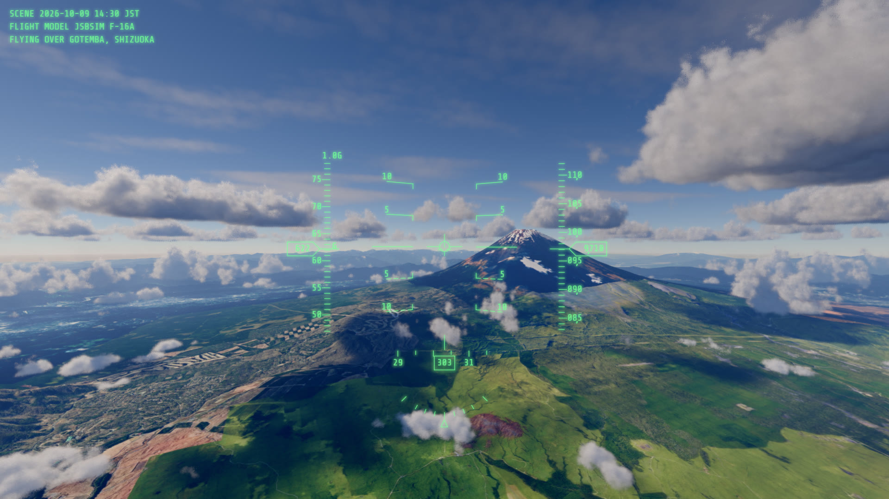
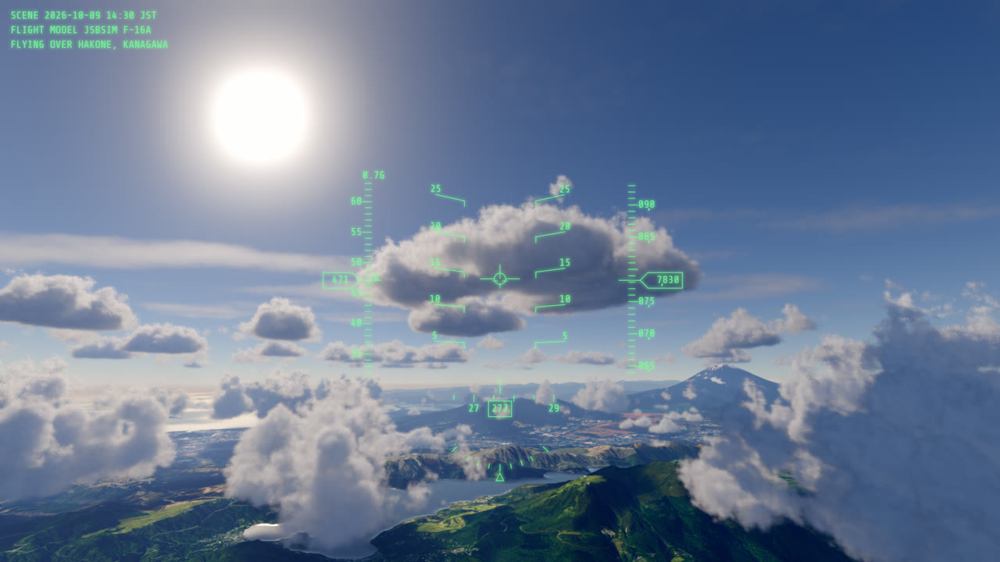
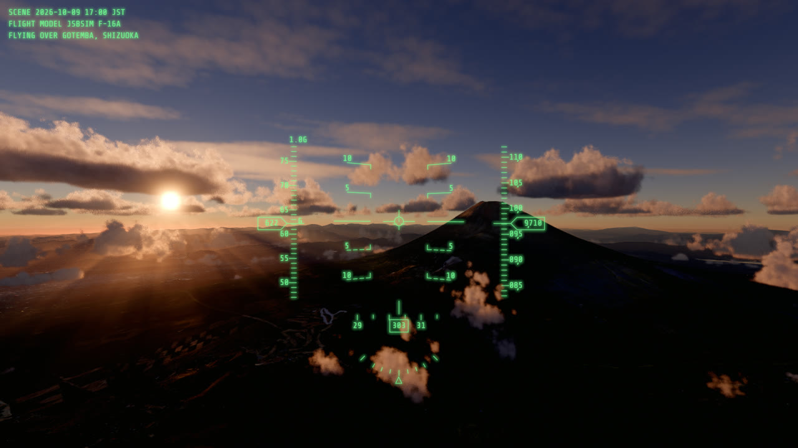
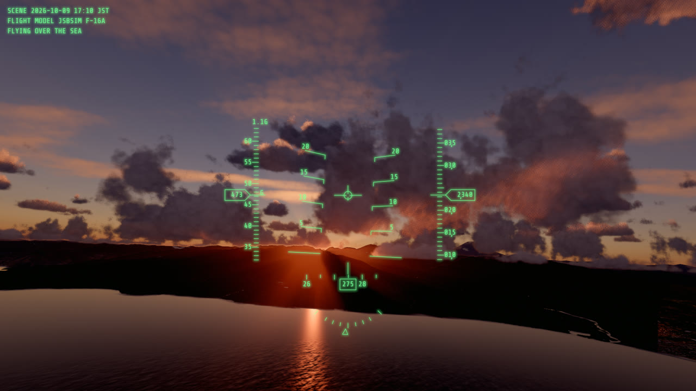
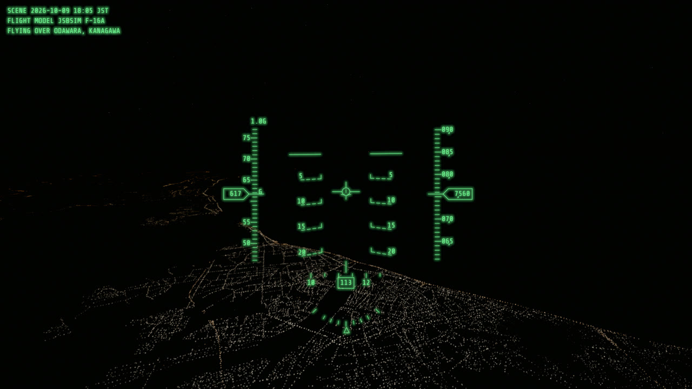

# webgpu-skyscape

How far can sky, clouds and ground be rendered in a web browser with WebGPU? This demo flies an
F-16 on a six-minute loop from Sagami Bay over Hakone to Mount Fuji and back, at 250 to 320 m/s,
through volumetric clouds and over terrain streamed in real time from Japan's national map tiles.
The flight is computed offline with the JSBSim flight dynamics model; the sky comes from takram's
atmosphere, and the clouds are takram's, ported to WGSL to run on WebGPU.

Try the **[demo page](https://nagoya0.github.io/webgpu-skyscape/)** in a desktop browser with
WebGPU. It downloads 50 to 150 MB of terrain and aerial photographs, so a mobile connection is
best avoided.

[](docs/images/fuji.jpg)

<p>
  
  
  
  
</p>

Clouds over Hakone, Mount Fuji at 17:00, sunset over Sagami Bay, and Odawara at night. Every
picture is the demo as it runs, at 1920 × 1080.

https://github.com/user-attachments/assets/685df7a8-2b32-444a-a4f3-9de7daab86d0

## How it works

```
 offline                                   in the browser, every frame
 ───────                                   ───────────────────────────
 JSBSim F-16 + small autopilot ─▶ course.json ─▶ position, attitude, load factor
 numpy: FFT ocean ──────────────▶ ocean.bin  ─┐                │
 numpy: blue noise ─────────────▶ blue-noise ─┤                ▼
                                              │      ┌─ terrain: quadtree of GSI tiles
 GSI tiles (elevation, aerial photographs, ───┼─────▶│  (elevation + photographs + water mask)
 vector roads, buildings, water), at run time │      ├─ city lights on roads and buildings
 towns (2020 census districts) ───────────────┼─────▶│  in the densely inhabited districts
                                              │      ├─ sky, sun, moon, stars, aerial perspective
                                              └─────▶├─ volumetric clouds (WGSL)
                                                     ▼
                       lens flare ─▶ tone mapping ─▶ colour grading ─▶ temporal anti-aliasing
                                                     ▼
                                     water drops on the glass ─▶ HUD (Canvas 2D)
```

The terrain is refined where a photograph texel would cover more than about 1.5 pixels, out to
the horizon, with a sea-level sphere beyond it. Only the GSI's servers are contacted at run time;
tiles come from the browser's cache after the first lap, so nothing reaches the GSI after it. Any
date and time can be shown: at night the exposure follows the sun and the moon, and the towns
light up.

## Decisions worth explaining

The full record is in [docs/adr/](docs/adr/) (40 decisions). A few that shaped the demo:

**takram's clouds, ported to run on WebGPU.** The released `@takram/three-clouds` runs on
Three.js's WebGL renderer only. Its shaders were ported to WGSL and wired to the WebGPU renderer
through TSL, with its temporal upscaling, cascaded cloud shadows and light shafts
([ADR 0013](docs/adr/0013-port-the-clouds-to-tsl.md)). The cloud shadows reach the terrain
through the renderer's shadow system, and the clouds' density at the aircraft is computed on the
CPU from the same data, to shake the camera inside a cloud.

**Lake Ashi fell 725 m.** The 5 m elevation model has no data over lakes, and the missing values
read as sea level: the lake became a pit with cliffs for shores. The gaps are now filled from the
10 m model of the parent tile.

**A trimmed F-16 does not fly straight on its own.** Hands-off, a bank of 0.1° grew by a third
every two seconds until the aircraft rolled over. A small autopilot holds heading, bank, height
(through the load factor) and speed through the model's own fly-by-wire. The model's yaw damper
then fought the steady yaw of every turn and left 2.4° of sideslip, so the autopilot cancels its
term; turns are coordinated within about 0.1°, and the lap closes within about 9 m.

**The sea repeated.** Six summed waves repeated visibly, and 24 drew crossing stripes. The waves
are now an FFT ocean baked offline into a looping 3D texture and sampled at three sizes with hex
tiling, so no pattern repeats ([ADR 0029](docs/adr/0029-water-from-gsi-data.md)).

**A memory leak of 1 MB per terrain tile.** GPU memory grew by about 300 MB a lap. takram's blue
noise node loaded a new copy of its texture for every material it was set up in, and every
terrain tile has its own. Tracing it also showed that the noise file's origin and licence were not
stated, so the demo now makes its own blue noise and loads it once
([ADR 0038](docs/adr/0038-own-blue-noise.md)).

## Repository layout

| Path | What it is |
| --- | --- |
| `src/terrain/` | GSI tiles to a terrain quadtree, water masks, the photographs' correction |
| `src/clouds/` | The cloud port: WGSL shaders, the passes, cloud shadows, density on the CPU |
| `src/render/` | The post-processing chain |
| `src/hud/` | The HUD, after the F-16C's |
| `src/flight/`, `src/camera/` | Playing the computed path; the first-person camera |
| `src/ui/` | Header, settings window, loading and guidance screens (Preact) |
| `tools/` | Offline: the flight path (JSBSim), the ocean and the blue noise (numpy) |
| `patches/` | Patches to takram's packages for Three.js 0.186 ([ADR 0016](docs/adr/0016-patch-takram-for-newer-three.md)) |
| `docs/` | Decisions ([adr/](docs/adr/)), open questions and the plan ([ideas.md](docs/ideas.md)) |

## Development

```sh
pnpm install
pnpm dev            # development server
pnpm test           # unit tests (Vitest)
pnpm build          # type-check and build
```

Every push to `main` is published on GitHub Pages by `.github/workflows/pages.yml`. Settings can
also be given in the URL, such as `?time=06:00&coverage=0.5` or `?t=150&paused`; the full list,
including switches for debugging, is at the top of [src/params.ts](src/params.ts). The offline
tools in `tools/` each have their own Python venv and a usage note at the top of their script;
checks and upgrades are in [docs/upgrading.md](docs/upgrading.md).

## Requirements and known limitations

- WebGPU only, with no WebGL fallback; other browsers get a page saying what is missing
  ([ADR 0003](docs/adr/0003-webgpu-only.md)). The GPU must support `float32-filterable` and a
  `maxColorAttachmentBytesPerSample` of at least 48.
- Aimed at a mid-range gaming PC (GeForce RTX 2060, Radeon RX 6600 XT) at 1920 × 1080 and
  60 fps ([ADR 0025](docs/adr/0025-target-hardware.md)). On the development machine, a GeForce
  RTX 4070, it keeps up with a 120 Hz display, the GPU taking about 2 ms a frame at 1262 × 600.
  Tested browsers are to be listed.
- Night has moonlight, stars, the night sky's glow and city lights; far towns show only as thin
  lines of points, without the glow they have from the air.
- The JavaScript heap grows by about 30 MB a lap, from Three.js's data for each terrain tile's
  material.
- On hold: finer terrain shading, takram's remaining cloud features
  ([docs/clouds-parity.md](docs/clouds-parity.md)), forests and fighter manoeuvres.

## Licence and credits

This project's own code and files are under the [MIT License](LICENSE). The data and the files of
others that it uses or includes keep their own licences, listed below.

### Data

- Terrain and aerial photographs: [GSI tiles (地理院タイル)](https://maps.gsi.go.jp/development/ichiran.html),
  Geospatial Information Authority of Japan (出典：国土地理院). The elevation tiles
  (`dem5a_png`, `dem_png`) and the seamless photographs (`seamlessphoto`) are processed into
  terrain meshes and textures, and the water areas of the vector tiles (`optimal_bvmap-v1`) into
  water masks, by this project.
- Municipal boundaries for the HUD's "FLYING OVER" line:
  [National Land Numerical Information, Administrative Areas](https://nlftp.mlit.go.jp/ksj/gml/datalist/KsjTmplt-N03-2024.html)
  (国土数値情報（行政区域データ）国土交通省, N03 2024, CC BY 4.0), cut to the course's
  surroundings, thinned and named in romaji by this project (`scripts/build-municipalities.mjs`,
  `public/places/municipalities.json`).
- Towns lit at night: [National Land Numerical Information, Densely Inhabited Districts](https://nlftp.mlit.go.jp/ksj/gml/datalist/KsjTmplt-A16-2020.html)
  (国土数値情報（人口集中地区データ）国土交通省, A16 2020, Government Standard Terms of Use 2.0,
  compatible with CC BY 4.0), cut to the course's surroundings and thinned by this project
  (`scripts/build-urban-areas.mjs`, `public/places/urban-areas.json`). Roads and buildings for the
  lights come from the GSI vector tiles above.
- Stars: `public/stars/stars.bin` from [@takram/three-atmosphere](https://github.com/takram-design-engineering/three-geospatial)
  (MIT), the directions, magnitudes and colours of the stars in the Bright Star Catalogue, 5th
  Revised Edition (Hoffleit, D. and Warren, W. H. Jr., 1991; Yale University Observatory),
  distributed by CDS, Strasbourg (catalogue V/50) and NASA's HEASARC.

### Code and assets

| Project | Use | Licence |
|---|---|---|
| [three.js](https://threejs.org/) | Renderer | MIT |
| [@takram/three-atmosphere, @takram/three-geospatial](https://github.com/takram-design-engineering/three-geospatial) | Sky, aerial perspective, temporal anti-aliasing, lens flare | MIT |
| [@takram/three-clouds](https://github.com/takram-design-engineering/three-geospatial) | The cloud shaders in `src/clouds/wgsl/` are ported from it, and its noise and weather textures are in `public/clouds/` | MIT, Copyright (c) 2024 Shota Matsuda ([licence](public/clouds/LICENSE-takram.txt)) |
| [three-csm](https://github.com/StrandedKitty/three-csm/) | The cascaded shadow maps in `src/clouds/cascadedShadowMaps.ts`, through takram's version | MIT, Copyright (c) 2019 vtHawk |
| [JSBSim](https://github.com/JSBSim-Team/jsbsim) and its F-16 model | Computing the flight path offline (`tools/flightpath/`, which installs JSBSim with pip). Neither JSBSim nor the model is in this repository, only the computed path, which contains no part of them | JSBSim: LGPL-2.1 or later; the F-16 model (Erik Hofman): GPL |
| [Share Tech Mono](https://fonts.google.com/specimen/Share+Tech+Mono) | The HUD's typeface (`public/fonts/`) | SIL Open Font License 1.1, Copyright (c) 2012 Carrois Type Design, Ralph du Carrois ([licence](public/fonts/OFL-ShareTechMono.txt)) |
| [fast-png](https://github.com/image-js/fast-png) | Decoding the clouds' weather map, so the CPU reads the same values as the GPU | MIT |
| [Preact](https://preactjs.com/) and [@preact/signals](https://github.com/preactjs/signals) | The UI | MIT |
